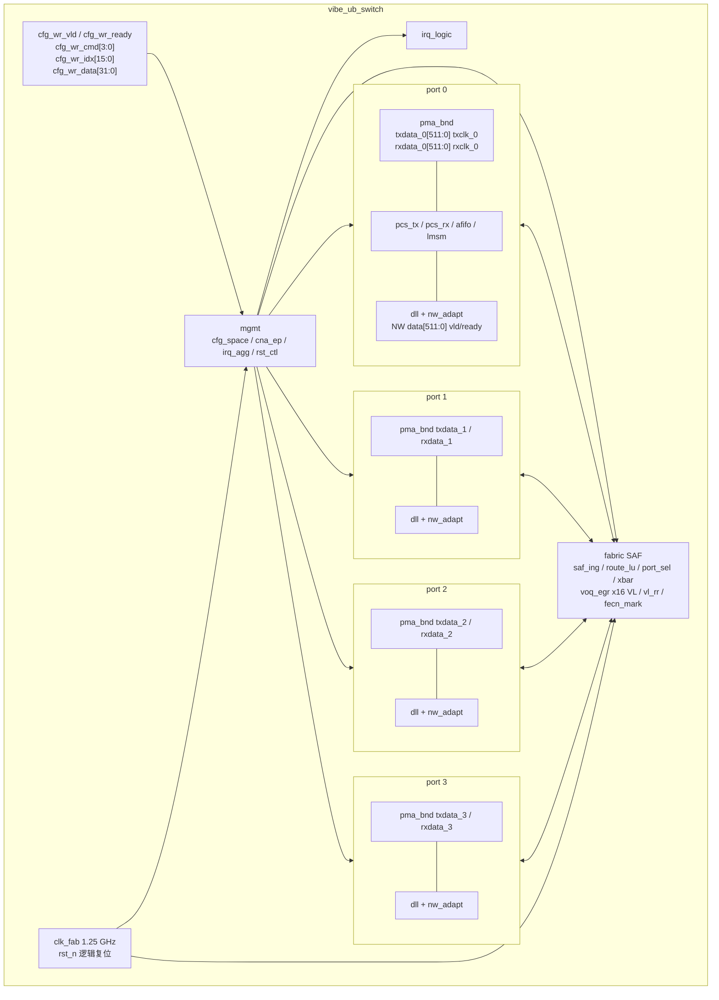
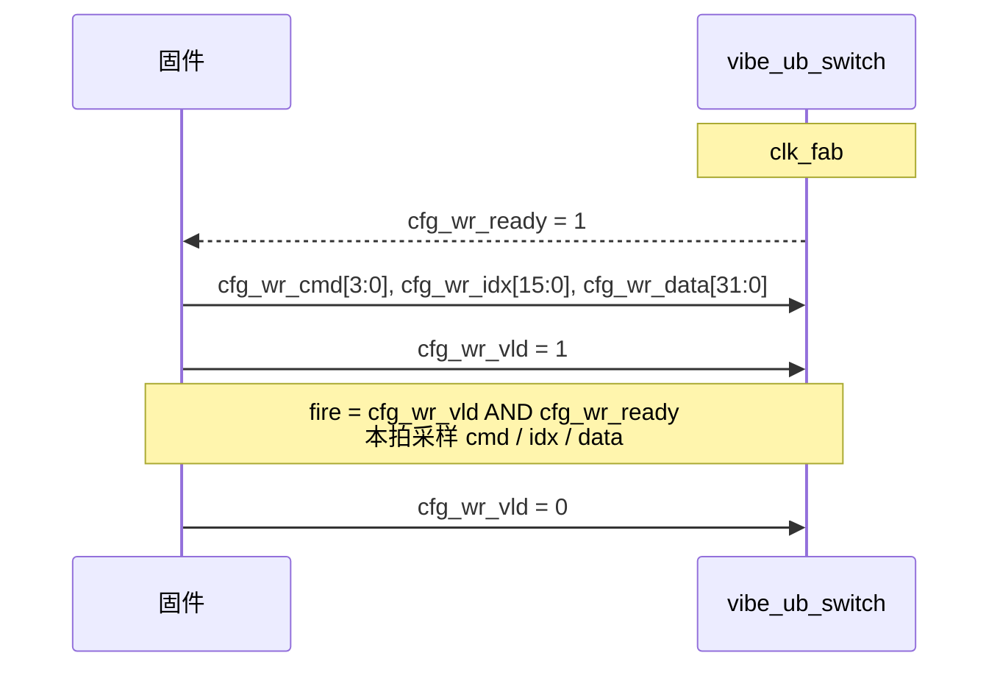
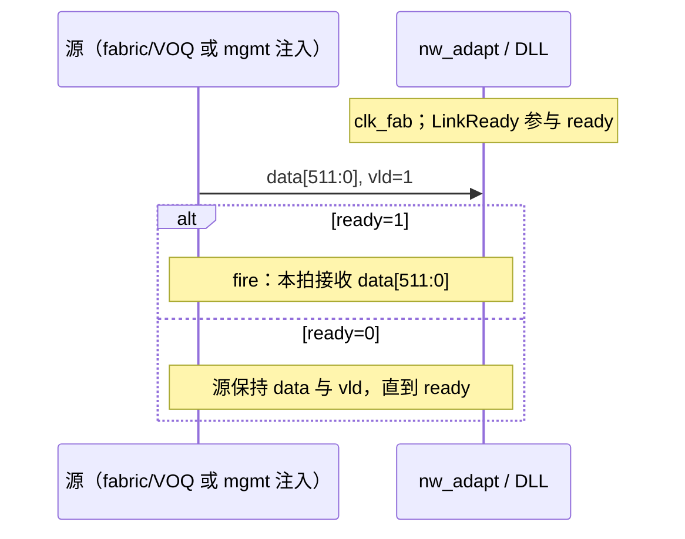
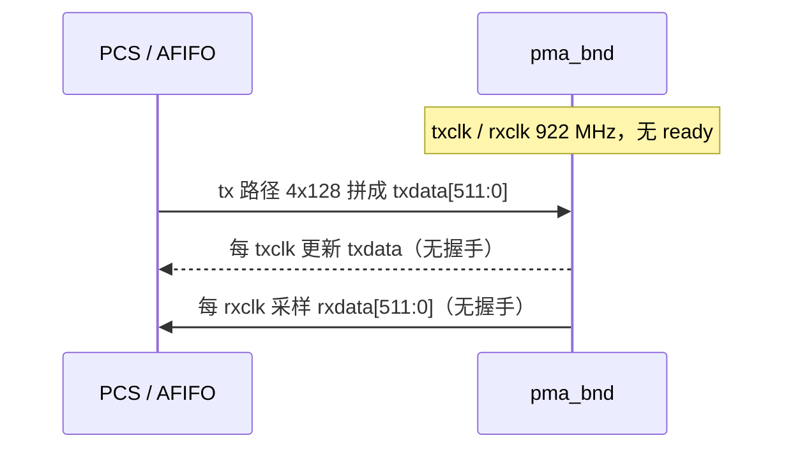

# Vibe-UB-Switch 芯片规格书

| 项 | 内容 |
|----|------|
| 文档编号 | SPEC-0.1-freeze-candidate |
| 状态 | **冻结候选** |
| 作者 | Xia |
| 协议 | Unified Bus (UB) Base 2.0 |
| 对齐功能规格 | FS-0.2.7（已实现锁定事实；真源不在本仓库） |
| 对齐架构 | [AS-0.1](Vibe-UB-Switch-architecture-spec.md) / AS-0.1.2，含 Overlay B |
| 对齐固件头 | [`include/vibe_ub_switch_regs.h`](../include/vibe_ub_switch_regs.h)（PR21 / `main`） |
| 对齐寄存器手册 | [Vibe-UB-Switch-register-map.md](Vibe-UB-Switch-register-map.md) |
| 对齐 RTL | freeze-candidate SHA `32a7f5e0`（匹配 RTL 的引用，不是本 SPEC 对功能的改写） |

本文件是冻结门：芯片开发 PM 据此验收。状态为 **冻结候选**，在人类点头之前不得写成“已冻结”。冻结后，接口变更须走变更请求。

本修订不改写 FS-0.2.7 已实现功能；SHA `32a7f5e0` 只标明与本冻结候选对齐的 RTL，不构成规格功能变更。

覆盖空洞（`tb/vibe/results/COVERAGE_HOLES.md` 九项 HOLE）以及其余不在本冻结范围内的项，一律放在 **§非目标**。冻结需求正文只写已锁定事实，不写未发布占位。

---

## 1. 角色与验收

- 本文件冻结的是 **产品逻辑接口与已锁定行为**，不是封装球图，也不是模拟 PMA。
- 验收对象：4 端口独立 UB Switch（Entity 0，Port 0..3），协议 2.0，无 UBFM。
- 固件接口是顶层静态写握手，**不是 MMIO**，没有地址译码，没有 APB / AXI / I2C / JTAG。
- 冻结后变更 `cfg_wr_*`、`irq_logic`、每端口 PMA `txdata`/`rxdata`/`txclk`/`rxclk`、以及 NW↔DLL `data[511:0]` `vld`/`ready` 的语义，须提变更请求。

---

## 2. 锁定功能事实（FS-0.2.7）

下列事实已经实现，构成本冻结的功能正文：

| 项 | 锁定内容 |
|----|----------|
| 拓扑 | 4 端口独立 UB Switch，Entity 0，Port 0..3 |
| 协议 | UB 2.0 |
| Flit | 20 字节；640 位是 DLL↔PCS 窗，不是 flit |
| Overlay B 宽度 | NW↔DLL（及 NW↔fabric）`data[511:0]`；640 位窗在 DLL↔PCS |
| PHY | Mode-2 PAM4 106.25 Gbit/s ×4 对称 |
| 路由 G1 | RT=10 / RT=11：**丢弃** + 递增 `rt_shortest_unimpl` + 置 `irq_logic`；不做最短路径 / Dijkstra；不得当 RT=00/01；不得改写 RT |
| 信用返回阈值 | **1024 cell**（不是 flit，不乘 grain） |
| 重传缓冲 | `RETRY_BUF_DEPTH` = 256 |
| 信用超时 | 1 µs → DL Protocol Error |
| 死锁超时 | 1 µs，VOQ 超时丢弃 + 计数 + `irq_logic`；与信用 1 µs 独立 |
| 交换网 | 存储转发（SAF），不做 cut-through |
| `clk_fab` | 1.25 GHz |
| PMA | `txdata[511:0]` / `rxdata[511:0]` @ 922 MHz，无额外握手 |
| LinkReady | 参与 NW `vld`/`ready`（U21） |
| UBFM | 不实例化 |
| CNA | 仅静态写；DCNA 匹配由 `cna_written` 门控 |
| VL | VL0–15 硬件在场；egress 非空 VOQ 之间 RR；同 VL 内 FCFS；无 SL |
| CFG0 | 在每端口 DLL 终结，不进 fabric |
| CFG6 | 仅当 DCNA == 已写本端 CNA，或 `NLP=1` 枚举，或 opcode `0x10` 指向本设备时终结；否则转发 |

---

## 3. 顶层框图

产品脚只使用 AS §18 / 顶层模块已点名的名字。NW `data[511:0]` 是端口内架构接口（NW↔DLL / NW↔fabric），不是封装球。



模块树（与 AS §4 一致）：

```
vibe_ub_switch
├── port[3:0]
│   ├── pma_bnd
│   ├── afifo_tx[3:0], afifo_rx[3:0]
│   ├── pcs_tx / pcs_rx
│   ├── lmsm
│   ├── dll
│   └── nw_adapt
├── fabric
└── mgmt
```

---

## 4. 产品引脚与接口时序

### 4.1 已点名顶层脚

| 脚 | 方向 | 宽度 | 作用 |
|----|------|------|------|
| `clk_fab` | in | 1 | 交换网 / DLL / PCS 数字 / LMSM / mgmt，1.25 GHz |
| `rst_n` | in | 1 | 逻辑复位（本冻结只要求该逻辑脚） |
| `txclk_0`..`txclk_3` | in | 1 | 每端口独立 TX 时钟，922 MHz |
| `rxclk_0`..`rxclk_3` | in | 1 | 每端口独立 RX 时钟，922 MHz |
| `txdata_0`..`txdata_3` | out | 512 | PMA TX；`[127:0]`=lane0 … `[511:384]`=lane3 |
| `rxdata_0`..`rxdata_3` | in | 512 | PMA RX；切片同 TX |
| `cfg_wr_vld` | in | 1 | 静态写选通 |
| `cfg_wr_ready` | out | 1 | 静态写就绪；`vibe_cfg_space` 中恒为 1 |
| `cfg_wr_cmd` | in | 4 | 命令编码 = 固件“地址” |
| `cfg_wr_idx` | in | 16 | 索引 / 端口选择 |
| `cfg_wr_data` | in | 32 | 写数据 |
| `irq_logic` | out | 1 | 可观察错误的粘滞或；固件只读该脚 |

没有 `cfg_rd_*`。没有额外 IRQ 脚、额外复位脚、主机 CSR 总线脚。

### 4.2 静态写 fire（`cfg_wr` `vld`/`ready`）

时钟：`clk_fab`。`cfg_wr_cmd` / `cfg_wr_idx` / `cfg_wr_data` 在 fire 拍保持稳定。`cfg_wr_ready` 恒 1，因此 `cfg_wr_vld==1` 的每个 `clk_fab` 周期即一次 fire。被接受的写（含 cmd 6–15）脉冲 `irq_clr`。



### 4.3 NW `data[511:0]` `vld`/`ready`

时钟：`clk_fab`。Overlay B：NW↔DLL 与 NW↔fabric 仅为 `data[511:0]` + `vld`/`ready`。LinkReady 参与 `ready`。无额外 enable 名。Fire 当拍 `vld==1` 且 `ready==1`，该拍 `data[511:0]` 被接收。TX 可逐级向 NW 反压。



### 4.4 PMA `txdata`/`rxdata`（无额外握手）

每端口 `txclk` / `rxclk` 独立，922 MHz，不假定同源。产品 PMA 只有 `txdata[511:0]`、`txclk`、`rxdata[511:0]`、`rxclk`。没有 PMA `ready`、没有额外握手名。`txdata` 在 `txclk` 上每拍都是数据；`rxdata` 在 `rxclk` 上每拍都是数据。RX AFIFO 溢出：丢拍、计数、置 `irq_logic`。



---

## 5. 时钟、复位与电源

| 时钟 | 频率 | 域 |
|------|------|-----|
| `clk_fab` | 1.25 GHz | 交换网、DLL、PCS 数字、LMSM、mgmt |
| 每端口 `txclk` | 922 MHz | PMA TX / TX AFIFO 读侧 |
| 每端口 `rxclk` | 922 MHz | PMA RX / RX AFIFO 写侧 |

CDC 是架构实现：每 lane 灰码指针 AFIFO，深度与几乎满阈值见 §13 架构参数。跨 1.25 GHz ↔ 922 MHz。本冻结不另立电压域，不发明电源脚或电源岛名字。

逻辑复位：

- `rst_n`：器件逻辑复位。
- Port Reset（cmd 3）：只作用于 `cfg_wr_idx[1:0]` 指定端口 → 该端口 LMSM `Link_Idle`、`DLL_Disabled`、retry 指针 0、`NumFreeBuf=256`。不复位其他端口，不复位全局路由表。Port Reset 保持本身不清除 `irq_logic`。
- Device reset（cmd 4）：清可写配置为未写（CNA 未写，`cna_written=0`，`default_bm` 回 `4'h0`）。不得单独强制 `DLL_Disabled`。LMSM → `Link_Idle`。

额外复位脚名 / 极性 / 同步方式见 §非目标（TP-HOLE-G4）。

---

## 6. 数据通路（Overlay B）

Flit = 20 字节。640 位窗只出现在 DLL↔PCS（4 flit / 拍）。NW 与 fabric 包体是 512 位字节流。

### 6.1 TX（`clk_fab` 再 `txclk`）

| 级 | 功能 |
|----|------|
| T0 | `nw_adapt`：`data[511:0]` `vld`/`ready`；LinkReady 参与 `ready`；mgmt 回复在 ingress TX、`nw_adapt` 之前注入，优先于 VOQ |
| T1 | `dll_tx`：512 位 NW 字节流切成 20 字节 flit；凑齐 4 flit 后向 PCS 发一拍 640 位（末 32 位 BCRC）。信用不足 / retry 满 / `REQ`\|`WAIT` 丢数据 / pending credit ≥ 1024 cell 时反压。短 EOP 余数 Null 填充到下一个 4-flit 组；`dll_rx` 在交出已声明包后丢掉该填充 |
| T2 | `pcs_tx_g1`：收集 6 flit（640 位 = 4 flit，故 1.5 拍 + 320 位余数）。空闲插入 Null Block 填满 FEC 窗 |
| T3 | `pcs_tx_fec`：双路 RS(128,120) 交织；T=4 默认 / T=2 / bypass（`3'b010` / `3'b001` / `3'b000`）。bypass 跳过编码器，仍 6-flit 对齐 |
| T4 | `pcs_tx_cw2beat`：1024 位码字拆成两拍 512 位 |
| T5 | `pcs_tx_pack` G2：512 位拍 + AMCTL（FEC 外）→ 640 位 = 4×160 进 AFIFO；`almost_full` 反压 |
| T6 | `afifo_tx` 写 160 位 @ `clk_fab` |
| T7 | 读 128 位 @ `txclk`，32 位余数齿轮箱 |
| T8 | `pma_bnd` 拼成 `txdata`。无 PMA ready |

AMCTL：每 lane 40 symbol，eBCH-16；SDF 之后数据期每 640 symbol，其余 LMSM 状态每 512 symbol。插在 FEC 之后、G2 之前。扰码覆盖 LTB，不覆盖 AMCTL/EEIB。Gray / 预编码不实现（模拟 PMA，§非目标）。

### 6.2 RX（TX 的逆）

`rxdata` 4×128 @ `rxclk` → `afifo_rx` → 160 位 @ `clk_fab` → 解包 / 去 AMCTL / deskew → 2×512 码字 → RS 译码（失败 → `fec_fail` 给 DLL 做 Go-Back-N；不实现 `hi_FEC_BER`）→ `dll_rx` BCRC + CFG0 终结 → `nw_adapt` `data[511:0]` 进 fabric。

U24：不做极性 / 车道对调训练。出厂假定物理 lane = 逻辑 lane。`AMCTL.LID` 不是 `{0,1,2,3}` 则失败到 `Link_Idle` 或 Retrain，不对调车道。

训练完成前不得向 DLL 送业务 flit。

---

## 7. 交换网

存储转发：在 EOP / 已声明长度收齐之前，不向 xbar 呈现。最大包 4300 B；长度不在 16–4300 B → Packet Length Error，丢弃并置 `irq_logic`。

组装之后 8 级：descriptor、length、NTH/LPH 解析、CFG 分类、仅当本端是目标时做 ICRC（过境即使改写 CCI/LBF 也不得重算 ICRC）、`route_lu`、`port_sel`、xbar grant。

路由：`CFG0_ROUTE_TABLE` dest → 4 位出口位图。

- RT=00：按流粘滞 RR。流键 `{CFG, src, dest, VL}`。
- RT=01：按包 RR。
- RT=10 / RT=11：丢弃，递增 `rt_shortest_unimpl`，置 `irq_logic`。

默认路由表全 0 → 端口 0。无 Port CNA，无 SCNA 比较，无 flood / broadcast，无 Exact Route，无 UPI / Port IP 路由。

可用端口 = 位图 AND `DLL_Status_Up`。过滤后为空 → Default；Default 全 0 → 端口 0；端口 0 也 Down 则丢弃+计数，不泛洪。

VL 来自头。VL0–15 硬件在场。egress 非空 VOQ 之间 RR；同 VL 内 FCFS。无 SL。

FECN：仅当 `CCI.Mode` 为 `3'b100` 或 `3'b010`，且本地拥塞（VOQ 占用 ≥ `FECN_WM`，架构默认 24 = 32 的 3/4）劣于包上标记时，改写 FECN 与 LoC。不是 CAQM。

死锁超时：从 VOQ 入队起 1 µs = 1250 个 `clk_fab` 周期；到期丢弃+计数+`irq_logic`。

xbar：出口排队，冲突时 ingress RR，一次 grant 一整包。Down 端口无 DLLDP。mgmt bypass FIFO 不进 xbar；mgmt 回复从该 ingress 端口 TX、`nw_adapt` 之前注入，优先于 VOQ。

---

## 8. CFG 分类

| CFG | 行为 |
|-----|------|
| CFG0 | 每端口 DLL 终结 / 产生，永不进 fabric。CFG0 DLLCB 不消耗 data credit |
| CFG 3/4/5/7/9 以及保留 1、2、8、10–15 | 转发（适用类型且 dest 是本端时按类型终结） |
| CFG6 | DCNA == 已静态写入的本端 CNA，或 `NLP=1` 枚举，或 opcode `0x10` 指向本设备 → 终结；否则转发 |
| CFG9 | 无 ICRC，转发；不作本端 home 终结 |

`cna_written` 为 0 时不得用任何复位存储值做 DCNA 匹配。复位存储 `CNA=16'h0` 不是产品 CNA。上电产品 CNA 默认见 §非目标（TP-HOLE-G5）。

CNA 宽度 16 bit。无自制泛洪。

---

## 9. 固件（静态写，无 MMIO）

与 PR21 / `main` 头文件 [`include/vibe_ub_switch_regs.h`](../include/vibe_ub_switch_regs.h) 一致。固件“地址”是 `cfg_wr_cmd[3:0]`，不是十六进制总线偏移。没有 `cfg_rd_*`。

### 9.1 命令表

| `cfg_wr_cmd` | 名 | 动作 | 访问 |
|--------------|----|------|------|
| 0 | `CMD_CNA` / `VIBE_CMD_CNA` | 写 `CNA[15:0]`（`cfg_wr_data[15:0]`），置 `cna_written` | WO |
| 1 | `CMD_ROUTE_TABLE` / `VIBE_CMD_ROUTE_TABLE` | 写路由表项：`cfg_wr_data[3:0]` = 出口位图，`cfg_wr_idx[15:0]` = 索引 | WO |
| 2 | `CMD_DEFAULT_BM` / `VIBE_CMD_DEFAULT_BM` | 写 `default_bm[3:0]`（`cfg_wr_data[3:0]`） | WO |
| 3 | `CMD_PORT_RST` / `VIBE_CMD_PORT_RST` | Port Reset **RW1C**：端口 = `cfg_wr_idx[1:0]`；`cfg_wr_data[0]==1` 才启动该端口复位；`data[0]==0` 不启动 | RW1C |
| 4 | `CMD_DEVICE_RST` / `VIBE_CMD_DEVICE_RST` | 器件复位脉冲；`idx` / `data` 不用 | WO pulse |
| 5 | `CMD_LMSM_GO` / `VIBE_CMD_LMSM_GO` | 脉冲 `lmsm_go`；端口 = `cfg_wr_idx[1:0]`；`cfg_wr_data` 不用 | WO pulse |
| 6–15 | （忽略编码） | 无配置副作用；仍脉冲 `irq_clr` | ignore |

路由表 RAM 在 fabric。查找只用位图 `[3:0]`。`ROUTE_TABLE_DEPTH` 是架构参数（RTL 默认 256，索引用 `[7:0]`），**不是**产品 Route Table Max Index（§非目标 TP-HOLE-G2）。

Port Reset：写 1 为 W1C，启动该端口序列；保持期间存储位为 1，`rst_ctl` 保持结束后硬件回到 0。无顶层读脚。

### 9.2 身份常量（编译期，不可经 `cfg_wr` 读出）

GUID Type `0x3`，Class `0x03` / `0x00`。头文件编译期常量：

| 符号 | 值 |
|------|-----|
| `VIBE_GUID0` | `32'h00000003` |
| `VIBE_CLASS_CODE` | `32'h00000300` |
| `VIBE_PORT_BASIC` | `32'h00040402` |
| `VIBE_PORT_CAP` | `32'h00000104` |

这些常量不在芯片脚上，不能通过 `cfg_wr` 读回。CFG6 终结时回显请求，不插入身份载荷。附录 D 其余切片与 CFG6 寄存器打包见 §非目标。

### 9.3 `irq_logic`

1 bit 粘滞或。固件只读该脚。清除：任意被接受的 `cfg_wr`、`rst_n`、或 device reset。Port Reset 保持不清除。无 per-cause 状态 CSR。额外 IRQ 脚名 / 极性 / 向量个数见 §非目标（TP-HOLE-G3）。本冻结只要求逻辑脚 `irq_logic`（AS：高有效电平）。

---

## 10. LMSM（每端口，本冻结子集）

实现这些状态：`Link_Idle` → `Discovery`（在 `lmsm_go` 上；无 Probe，无 RXEQ_Optimize）。

`Discovery.Active` / `Confirm`，`Config.Active` / `Check` / `Confirm`，`Send_NullBlock`（`LinkUp=1`；8 个 null → `Link_Active`；2 ms 超时），`Link_Active`（`LinkUp=1`，`LinkReady=1`，锁定 106.25 G），`Retrain.Active` / `Confirm`（不改速率），若 Config 协商 EQ 则 `EQ.*`（`Passive` 64 ms，`Active` 24 ms / 48 ms > DR4）。

宽度结果必须是 x4，否则失败到 `Link_Idle`。Lane 0 失败 → Retrain，不降宽。

定时器在 `clk_fab`（1.25 GHz：1 µs = 1250 周期）：

- `Discovery.Active`：从 Retrain/Config 来为 10 µs，否则 24 ms
- Confirm：48 ms
- `Config.*`：2 ms
- `Send_NullBlock`：2 ms
- `Retrain.Active`：24 ms
- pre-FEC BER + FEC 选择：22 ms

`lmsm_go` 的产品来源（谁在芯片外拉高）见 §非目标（TP-HOLE-G6）。本冻结只要求 cmd 5 对该端口脉冲 `lmsm_go`。

不实现：Probe、RXEQ_Optimize、Change_Speed、QDLWS、光通路、Fig 3-28 未点名弧、极性/车道对调训练、快速降宽。

---

## 11. DLL

状态：`Disabled`（`LinkUp==0` 则始终进入）、`Param_Init`、`Credit_Init`、`Normal`（`Status_Up`）。

器件复位不得单独强制 `Disabled`。

协商失败使用官方默认，但 VL1–15 硬件仍可用（`VL_ENABLE` 默认 `0x1`，其余经后续 CFG 打开）：

- `DATA_CREDIT_GRAIN` 4 cell/VL
- CTRL 1
- `FEATURE_ID=1`
- `RXBUF_VL_SHARE=0`
- `DATA_ACK_GRAIN` 32 flit
- `CTRL_ACK_GRAIN` 1
- `FLOW_CTRL_SIZE` 8 flit/cell

BCRC：CRC30 多项式 \(x^{30}+x^{28}+x^{26}+x^{24}+x^{23}+x^{21}+x^{19}+x^{16}+x^{14}+x^{11}+x^{9}+x^{7}+x^{6}+x^{4}+x^{2}+1\)，初值全 1，不取反。bit31 保留，bit30 `ERROR_FLAG`。

`retry_buf` 深度 256。`NumFreeBuf` 初值 256；`WrPtr` / `TailPtr` / `RdPtr` / `RcvPtr` 初值 0。Null 与 Retry 块不入缓冲。发送需要 `NumFreeBuf >= SendSize`。ACK 释放；`NumFreeBuf + ReleaseSize > 256` → DL Protocol Error。

`RETRY_REQ_SM`：`NORMAL`，`REQ`（1 Idle + 32 Req；`NUM_RETRY+1`；==15 或 PHY retrain → `RETRAIN`），`WAIT`（超时 → `REQ`；默认 `RETRY_WAIT_CYC=12500` = 10 µs，参数合法范围 1 µs–10 s），`RETRAIN`（`NUM_PHY_REINIT+1`；==4 → `ERROR`），`ERROR` 等待 Port / device reset → `NORMAL`。`NUM_RETRY=15`，`NUM_PHY_REINIT=4`。

`RETRY_ACK_SM`：`NORMAL`，`ACK`（1 Idle + 32 Ack，然后 `RdPtr=RcvPtr` 回放到 `WrPtr`）。

FEC 失败或 BCRC 失败走 Go-Back-N。

信用消耗 `ceil(DLLDP_flits / n)`，`n ∈ {1,2,4,8,...,128}`，默认 8。全 VL 最大 65535 cell。无 DLLDP 但有 pending credit → `Crd_Ack`。pending ≥ **1024 cell** → 反压 NW 并强制 `Crd_Ack`。信用返回超时 1 µs → DL Protocol Error。不发明 credit underflow。不把 RXBUF 静默扩到 1024 cell/VL；`dll_rxbuf` = 1024 flit/VL 独占（架构参数）。

DLLDP 1–512 flit；>32 flit 拆成 ≤16 个 DLLDB，每个 ≤32 flit。

`LinkUp==0`：TX 丢弃上层；未完成 RX DLLDP 填 0 + `ERROR_FLAG`；credit 0；指针 0；`NumFreeBuf=256`；`Disabled`。

DLL 信用 / retry 进入 ERROR：该端口停 TX/RX，等待 Port Reset 或 device reset（不是 UBFM）。

---

## 12. ICRC

CRC32 多项式 `0x04C11DB7`，初值 `0xFFFFFFFF`，按字节比特反转，结果再反转并取反。CCI/LBF 掩成 1；IPv4 TTL / HeaderChecksum / ToS、IPv6 TC / FlowLabel / HopLimit、UDP checksum 掩成 1。CFG3/4 从 IP 头起算；CFG6/7 从 NTH 起算；CFG9 无 ICRC。只在发送端 / 接收端（`cna_ep`）计算 / 检查。过境路径无 ICRC 单元。

---

## 13. 缓冲与参数

**FS-must（本冻结要求）：**

| 参数 | 值 |
|------|-----|
| `retry_buf` / `RETRY_BUF_DEPTH` | 256 |
| 信用返回阈值比较器 | 1024 **cell** |
| 信用超时 | 1 µs |
| 死锁超时 | 1 µs |
| `NUM_RETRY` | 15 |
| `NUM_PHY_REINIT` | 4 |

**架构参数（实现选型，不是产品 Max Index，也不是性能指标）：**

| 参数 | 值 |
|------|-----|
| AFIFO 深度 | 16（指针 5 bit，2-FF 同步；写域占用 ≥ 10 为 `almost_full`） |
| `dll_rxbuf` | 1024 flit/VL |
| `saf_ing` pkt_mem | 深度 128 |
| VOQ | 32 flit / VL / egress |
| mgmt bypass | 深度 16 |
| `FECN_WM` | 24 |
| `AMCTL_CONFIRM_N` = `UNLOCK_N` | 3 |
| `ROUTE_TABLE_DEPTH` | 默认 256 |

---

## 14. 错误 → `irq_logic`（粘滞）

必须可观察并或到 `irq_logic`：

- RX buf overflow
- FC overflow
- DL Protocol Error（信用超时与 `NumFreeBuf` 溢出）
- DL Retry Error（15×4）
- ICRC fail（接收端）
- Packet Length Error
- 死锁丢弃
- RT=10/11 未实现最短路径
- RX AFIFO overflow

Retry ACK 超时 / 回绕：计数并走自动重传，不要求单独作为 irq must。

FEC 失败：先 Go-Back-N，不是独立 irq must。

无 `hi_FEC_BER`。无 NPI mismatch 丢弃。无 credit underflow 错误码。无 hotplug IRQ。

`rt_shortest_unimpl` 在 G1 时递增；其产品位宽与饱和规则见 §非目标（TP-HOLE-012）。

---

## 15. PHY

仅 Mode-2 PAM4 106.25 Gbit/s ×4 对称。每端口全双工。TX 侧全部车道同频。FEC RS(128,120) T=4 / T=2 / bypass，双编码器交织。DLL 封装只做 BCRC。无光通路。无模拟 PMA（Gray / 预编码 / SerDes 球，§非目标）。

---

## 16. 性能、面积与功耗

本冻结锁定的时钟是 `clk_fab` 1.25 GHz 与每端口 `txclk`/`rxclk` 922 MHz。

**不做要求：** hop 延迟、队列深度产品指标、线速利用率、对剖带宽（TP-HOLE-010）。`TP-FAB-004`：无 hop / qdepth MUST。

实现 QoR（面积、WNS/TNS、单元数）以工具生成的 [`reports/synth/`](../reports/synth/)（以及后续 [`reports/signoff/`](../reports/signoff/)）为准，**不是**本 SPEC 的必须项。本文件不给出 Sky130 WNS，不给出面积数字。

---

## 17. 非目标

本冻结 **不要求** 下列项。名称与 `tb/vibe/results/COVERAGE_HOLES.md` 九项 HOLE 对齐；其余为已点名的范围外功能。实现侧可以保留架构参数或内部计数，但它们不是产品验收门。

### 17.1 九项覆盖 HOLE

| ID | 本冻结不要求 |
|----|----------------|
| TP-HOLE-G2 Route Table Max Index | 产品路由表 Max Index。`ROUTE_TABLE_DEPTH` 只作为架构参数保留，不是产品 Max Index |
| TP-HOLE-G3 extra IRQ pin names / polarity / vector count | 额外 IRQ 脚名 / 极性 / 向量个数。本冻结只要求逻辑脚 `irq_logic` |
| TP-HOLE-G4 extra reset pin names / polarity / sync | 额外复位脚名 / 极性 / 同步。本冻结只要求逻辑 Port Reset / device reset 与 `rst_n` |
| TP-HOLE-G5 CNA power-on default | 产品上电 CNA 默认。匹配由 `cna_written` 门控；不得把复位存储 0 当作产品 CNA |
| TP-HOLE-G6 lmsm_go source | `lmsm_go` 的产品来源（芯片外来源）。本冻结只要求 cmd 5 脉冲 |
| TP-HOLE-G8 package / SerDes balls | 封装 / SerDes 球图 |
| TP-HOLE-G9 RXEQ Optimize / extra EQ | RXEQ Optimize / 额外 EQ（已不在本冻结 LMSM 集合内） |
| TP-HOLE-010 performance numbers | hop 延迟、线速利用率、对剖带宽 — 不做要求 |
| TP-HOLE-012 G1 counter width / saturation | `rt_shortest_unimpl` 产品位宽 / 饱和规则 |

### 17.2 其余本冻结不要求

- `cfg_rd_*`（AS 未点名静态读总线）
- CFG6 寄存器 R/W 打包
- 附录 D 超出已点名子集的切片（含官方 `PORT_BASIC` / `PORT_CAP` 字段打包、Appendix D MMIO 偏移）
- Exact Route
- UBFM
- cut-through
- 模拟 PMA（Gray / 预编码 / SerDes）
- CAQM、NPI 过滤数据通路、Transport / Transaction / Function endpoint、UMMU、UBoE
- Probe、Change_Speed、QDLWS、光通路
- 第五端口、host CSR 总线脚、片外 APB/AXI/I2C/JTAG
- Dijkstra / 最短路径（RT=10/11 已锁定为丢弃）

---

## 18. 变更控制

| 项 | 规则 |
|----|------|
| 当前状态 | **冻结候选**（须芯片开发 PM 点头后才升为冻结） |
| 冻结后接口 | `cfg_wr_*`、`irq_logic`、PMA `txdata`/`rxdata`/`txclk`/`rxclk`、NW `data[511:0]` `vld`/`ready` 变更须变更请求 |
| 功能改写 | 不得以“对齐 SHA `32a7f5e0`”为由改写 FS-0.2.7 已锁定行为 |
| 空洞升级 | §非目标项若要进入冻结正文，须变更请求，并更新本文件版本号 |

---

## 19. 参考

- [Vibe-UB-Switch-architecture-spec.md](Vibe-UB-Switch-architecture-spec.md) — AS-0.1 / AS-0.1.2
- [`include/vibe_ub_switch_regs.h`](../include/vibe_ub_switch_regs.h) — PR21 / `main` 固件头
- [Vibe-UB-Switch-register-map.md](Vibe-UB-Switch-register-map.md)
- [Vibe-UB-Switch-reg-diffs.md](Vibe-UB-Switch-reg-diffs.md)
- [Vibe-UB-Switch-testpoints.md](Vibe-UB-Switch-testpoints.md) — TP-0.3
- `tb/vibe/results/COVERAGE_HOLES.md` — 九项 HOLE
- [`reports/synth/`](../reports/synth/) — 实现 QoR（非本 SPEC 必须项）
- RTL freeze-candidate SHA `32a7f5e0`
